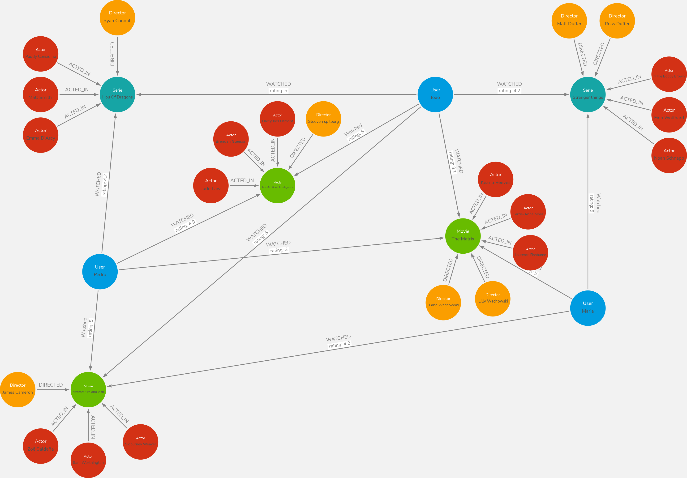

# Modelo de grafo

- Grafo referente ao exercício da DIO sobre "Modelagem de Dados em Grafos de um Serviço de Streaming"
- Um modelo de grafo com as seguintes entidades e relacionamentos:</br>
Entidades (nós): User, Movie, Series, Genre, Actor, Director.</br>
Relacionamentos (conexões): WATCHED (com propriedade rating), ACTED_IN, DIRECTED, IN_GENRE.


<br/>

### Modelo de inserção de dados ao NEO4J
````cypher
CREATE (n22:Serie {name: "Stranger things"})<-[:WATCHED {rating: 4.2}]-(n0:User {name: "João"})-[:WATCHED {rating: 5}]->(n1:Movie {name: "Ai - Artificial Inteligence"})<-[:DIRECTED]-(:Director {name: "Steeven spilberg"}),
(:Actor {name: "Haley Joel Osment"})-[:ACTED_IN]->(n1)<-[:ACTED_IN]-(:Actor {name: "Jude Law"}),
(:Actor {name: "Brendan Gleeson"})-[:ACTED_IN]->(n1)<-[:WATCHED {rating: 4.9}]-(n28:User {name: "Pedro"})-[:WATCHED {rating: 3}]->(n17:Movie {name: "The Matrix"})<-[:DIRECTED]-(:Director {name: " Lilly Wachowski"}),
(:Director {name: "Ross Duffer"})-[:DIRECTED]->(n22)<-[:WATCHED {rating: 5}]-(n16:User {name: "Maria"})-[:Watched {rating: 5}]->(n17)<-[:DIRECTED]-(:Director {name: " Lana Wachowski"}),
(:Actor {name: "Carrie-Anne Moss"})-[:ACTED_IN]->(n17)<-[:ACTED_IN]-(:Actor {name: "Laurence Fishburne"}),
(:Actor {name: "Keanu Reeves"})-[:ACTED_IN]->(n17)<-[:WATCHED {rating: 3.1}]-(n0)-[:WATCHED {rating: 5}]->(n34:Serie {name: "House Of Dragons"}),
(:Actor {name: "Finn Wolfhard"})-[:ACTED_IN]->(n22)<-[:ACTED_IN]-(:Actor {name: "Noah Schnapp"}),
(:Actor {name: "Millie Bobby Brown"})-[:ACTED_IN]->(n22)<-[:DIRECTED]-(:Director {name: "Matt Duffer"}),
(n34)<-[:WATCHED {rating: 4.2}]-(n28)-[:WATCHED {rating: 5}]->(n29:Movie {name: "Avatar: Fire and Ash"})<-[:DIRECTED]-(:Director {name: "James Cameron"}),
(:Actor {name: "Sam Worthington"})-[:ACTED_IN]->(n29)<-[:ACTED_IN]-(:Actor {name: "Zoë Saldaña"}),
(:Actor {name: "Sigourney Weaver"})-[:ACTED_IN]->(n29)<-[:WATCHED {rating: 4.2}]-(n16),
(:Director {name: "Ryan Condal "})-[:DIRECTED]->(n34)<-[:ACTED_IN]-(:Actor {name: "Matt Smith "}),
(:Actor {name: "Emma D'Arcy"})-[:ACTED_IN]->(n34)<-[:ACTED_IN]-(:Actor {name: "Paddy Considine"}),
(n0)-[:WATCHED {rating: 5}]->(n29)
````
